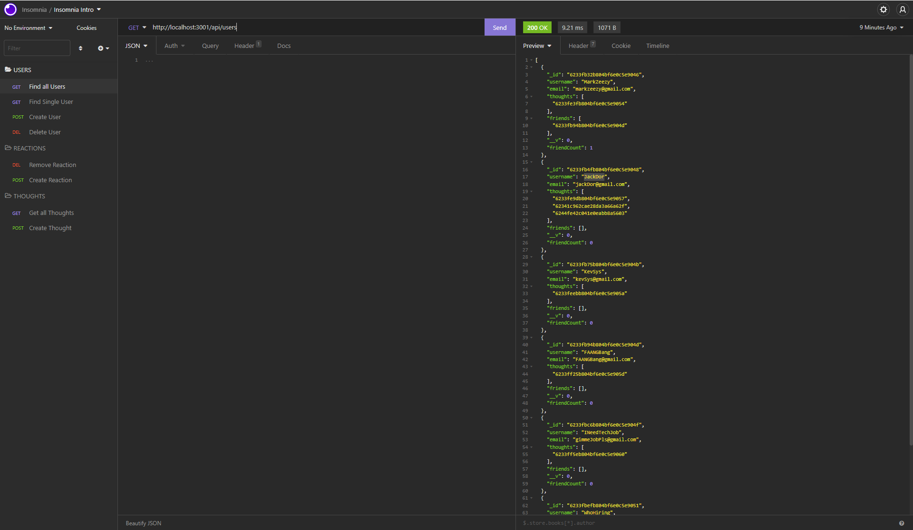
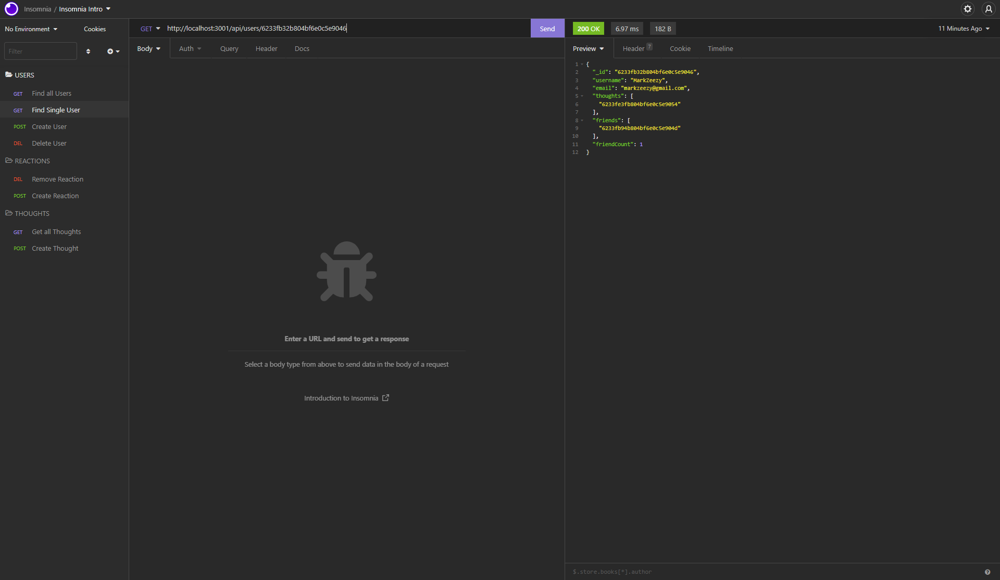
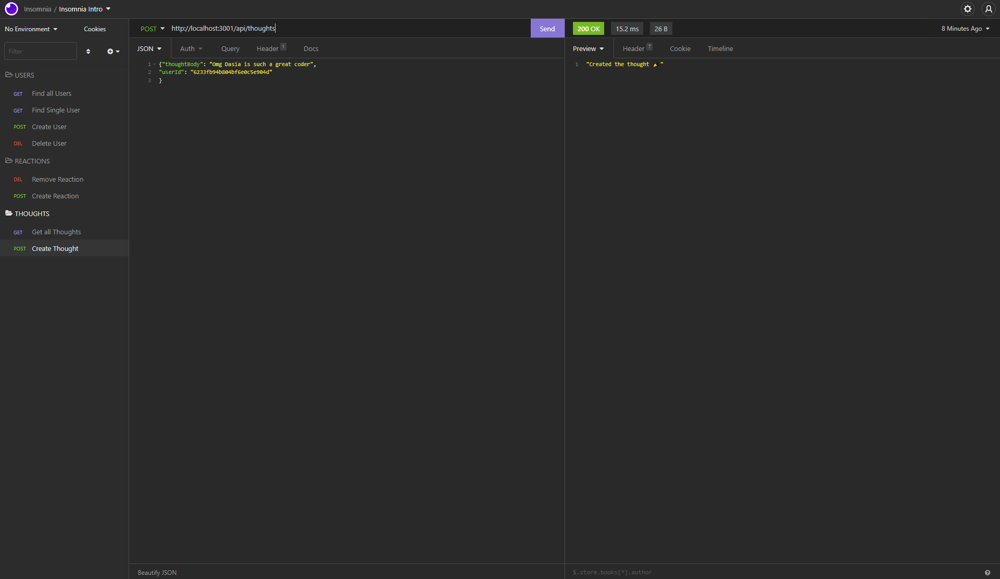
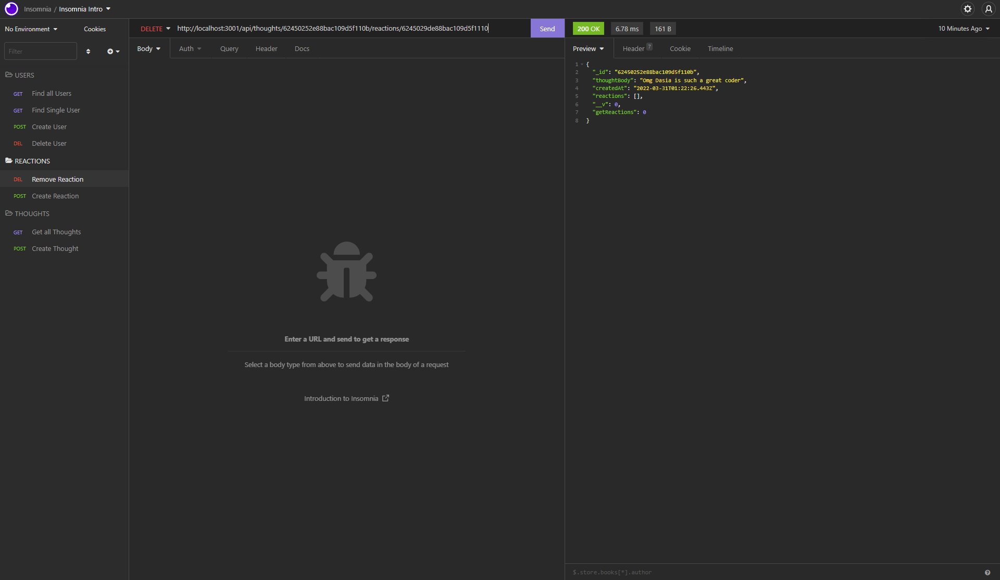

# 18 NoSQL: Social Network API
  
      https://opensource.org/licenses/MIT

  ## Description

  This application builds an API for a social network where users can share their thoughts, react to friends’ thoughts, and create a friend list. It utilizes Express.js for routing, a MongoDB database, and the Mongoose ODM. A video demonstration can be found [here](https://drive.google.com/file/d/1H7fOICaB4822x4oWwAcSRsIqt1RgQycB/view?usp=sharing)

  ## Table of Contents

  * [User Story](#userStory)

  * [Installation](#installation)

  * [Usage](#usage)

  * [License](#License)

  * [Contributing](#contributing)

  * [Tests](#tests)

  * [Questions](#Questions)

  ## User Story

  ```md
  AS A social media startup
  I WANT an API for my social network that uses a NoSQL database
  SO THAT my website can handle large amounts of unstructured data
  ```

  ## Mock Up

  The following animations show examples of the application's API routes being tested in Insomnia.

  The following picture shows GET routes to return all users and all thoughts being tested in Insomnia:

  

  The following picture shows GET routes to return a single user and a single thought being tested in Insomnia:

  

  The following picture shows the POST route for a new thought being tested in Insomnia:

  

  The following picture shows the DELETE route for a reaction being tested in Insomnia:

  

  ## Installation
  
  To install necessary dependencies run the following command:

  ```
  npm i
  ```

  ## Usage

  Confirm that all dependencies are installed and run application using

  ```
  npm start
  ```

  ## License

  This project is licensed under the MIT license.

  ## Contributing

  NA

  ## Tests

  To run tests, run the following command:

  ```
  
  ```

  ## Questions

  If you have any questions about the repo, open an issue or contact me directly at dasiasmith023@gmail.com. You can find more of my work
  at .